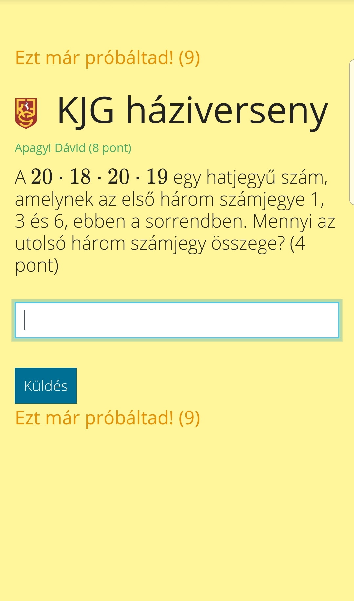

# KJG háziverseny
A hatodik osztályos nyílt matematika háziversenyre készült.

## Működés
### Kérdések beállítása (*questions.txt* fájlban):
- egy kérdés egy sor (új sort a \<br> beszúrásával lehet kezdeni)
- Feladat; pontszám; megoldás (például, négy pontért:  ```Mennyi 1-1?; 4; 0```)
- LaTeX beszúrható
- pontosvessző nem használható a feladat szövegében

### Indítás
```
$ npm install
$ node app
```
A kliensek nyissák meg a kiszolgáló helyi ip-jét böngészőben. 
### Admin
[Adminfelület](http://localhost/szupertitkos) funkciók:
- új kérdés küldése
- időkorlát beállítása
- kép küldése a public mappából
- tippek nyomonkövetése

### Alapértelmezett pontozás
Hibás megoldásért nem jár pontlevonás, hanem csökken a feladat pontértéke. Egy alá nem csökken a feladat pontértéke, tehát bárhanyadjára találja el a felhasználó a megoldást, kap legalább egy pontot.

A pontszám [grafikonon](http://localhost/stats) nyomonkövethető, kivetíthető.

## Képernyőképek



## Tennivalók, ötletek, fejlesztési lehetőségek
#### Általános
- könnyen felhasználhatóvá alakítani, a használatát jól dokumentálni és elérhetővé tenni másoknak (csalások, kiskapuk?)
#### Felhasználó
- kiküldött kép lekérése frissítéskor
#### Admin
- bejelentkezés (mi alapján?)
- barátságosabb felület
- automatikus kérdésléptetés az idő lejárta (/ + néhány másodperc) után, checkbox
- pontszám módosítása
- log a böngésző konzoljába
- adatok a verseny során
#### Szerver
- kérdések: időkorlát, kép opcionálisan beállítható (kérdéssor létrehozására és mentésére oldal? Ezeket az előre elkészített fájlokat később be lehetne tölteni. [külön mappa ezeknek, ahonnan választani lehet?])
- fájl frissülésre automatikusan töltse újra a kérdéseket
- debug elemek törlése
- fejlett log (mappa, fájlok létrehozása)
- program leállítása, log dátum-idő alapján való átmásolása
- admin üzeneteket elkülönítve küldeni (külön tárolni az admin socketeket) (socket.io szoba?)

<!--
```javascript
console.log("alma");
```
-->